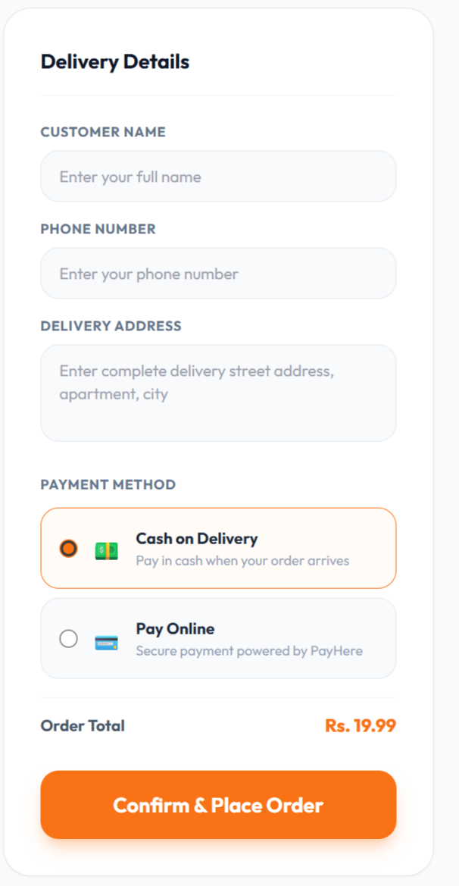
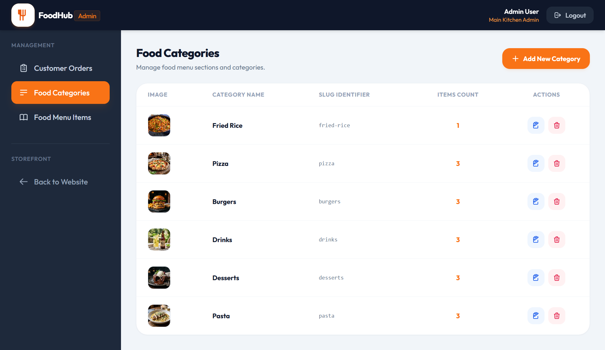
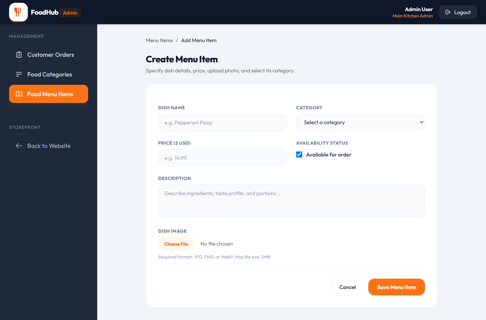

# 🍔 FoodHub — Restaurant Ordering & Management System

FoodHub is a full-stack restaurant ordering platform built with **Laravel**. It pairs a polished customer-facing storefront (browse menu, cart, checkout) with a complete admin back office (menu, categories, and order management) — giving a restaurant everything it needs to take orders online and run its kitchen workflow.


---

## ✨ Key Features

### Customer Storefront
- **Landing page** with hero banner, featured "Chef's Specialties," and quick category browsing (Pizza, Burgers, Drinks, Desserts, Pasta, Fried Rice)
- **Full menu page** with live search-by-name and one-click category filters
- **Shopping cart** with editable quantities, per-item subtotal, and item removal
- **Checkout flow** that captures customer name, phone, and delivery address, with a live bill breakdown (subtotal + flat delivery fee = total)
- **Dual payment options** — Cash on Delivery, or online payment via the **PayHere** gateway
- Responsive layout that adapts cleanly from desktop to mobile

### Admin Panel
- **Orders Manager dashboard** with at-a-glance stats: completed sales, total orders, pending approval count, and orders currently in the kitchen
- **Order status workflow** — orders move through `Pending → Preparing → Completed`, with filterable tabs and per-order payment status (COD / Pending)
- **Food Categories management** — full CRUD with auto-generated slugs and a live item count per category
- **Menu item management** — create/edit dishes with name, category, price, description, image upload (JPG/PNG/WebP, 2MB limit), and an availability toggle to instantly mark items in/out of stock
- Clean, sidebar-driven admin UI separated from the public storefront (`/admin` section with its own auth)

---

## 🖼️ Screenshots

| Storefront | Menu & Search |
|---|---|
|  |  |

| Cart & Checkout | Orders Manager |
|---|---|
|  |  |

| Manage Categories | Add Menu Item |
|---|---|
|  |  |

---

## 🛠️ Tech Stack

- **Backend:** Laravel (PHP)
- **Frontend:** Blade templates, Tailwind CSS
- **Database:** MySQL
- **Payments:** Cash on Delivery + PayHere (online payment gateway)
- **Storage:** Laravel file storage for menu item images

*(Update this section with your exact package/tooling choices — e.g. Livewire/Alpine.js, specific auth package, etc.)*

---

## 🗄️ Database Schema

```
categories                     menu_items                      orders
┌─────────────────┐            ┌─────────────────────┐         ┌──────────────────────┐
│ id           PK  │◄──────┐   │ id               PK  │    ┌───│ id                PK  │
│ name             │       └───│ category_id      FK  │    │   │ order_number      UQ  │  e.g. FH-20260815-QXVE5
│ slug         UQ  │           │ name                 │    │   │ customer_name         │
│ image                │           │ price                │    │   │ phone                 │
│ created_at       │           │ description          │    │   │ address               │
│ updated_at       │           │ image                │    │   │ payment_method        │  cod | online
└─────────────────┘           │ is_available  bool   │    │   │ payment_status        │  pending | paid
                               │ created_at           │    │   │ subtotal              │
                               │ updated_at           │    │   │ delivery_fee          │
                               └─────────────────────┘    │   │ total_amount          │
                                        ▲                  │   │ status                │  pending | preparing | completed
                                        │                  │   │ created_at            │
                                        │                  │   │ updated_at            │
                                        │                  │   └──────────────────────┘
                                        │                  │            ▲
                                        │                  │            │
                                        │           order_items         │
                                        │           ┌──────────────────────┐
                                        │           │ id               PK  │
                                        └───────────│ menu_item_id     FK  │
                                                    │ order_id         FK  ├─────┘
                                                    │ quantity             │
                                                    │ unit_price           │
                                                    │ subtotal             │
                                                    └──────────────────────┘

admins (or users w/ role)
┌─────────────────┐
│ id           PK  │
│ name             │
│ email        UQ  │
│ password         │
│ role             │  admin
│ created_at       │
│ updated_at       │
└─────────────────┘
```

### Table Details

**`categories`**
| Column | Type | Notes |
|---|---|---|
| id | bigint, PK | |
| name | varchar | e.g. "Pizza", "Burgers" |
| slug | varchar, unique | auto-generated, used in filters/URLs |
| image | varchar | category thumbnail path |
| timestamps | | |

**`menu_items`**
| Column | Type | Notes |
|---|---|---|
| id | bigint, PK | |
| category_id | bigint, FK → categories.id | |
| name | varchar | dish name |
| price | decimal(8,2) | |
| description | text | ingredients/taste profile |
| image | varchar | dish photo path |
| is_available | boolean | toggles "Available for order" |
| timestamps | | |

**`orders`**
| Column | Type | Notes |
|---|---|---|
| id | bigint, PK | |
| order_number | varchar, unique | e.g. `FH-20260815-QXVE5` |
| customer_name | varchar | |
| phone | varchar | |
| address | text | delivery address |
| payment_method | enum | `cod`, `online` (PayHere) |
| payment_status | enum | `pending`, `paid` |
| subtotal | decimal(8,2) | |
| delivery_fee | decimal(8,2) | flat fee |
| total_amount | decimal(8,2) | |
| status | enum | `pending`, `preparing`, `completed` |
| timestamps | | |

**`order_items`** *(pivot: orders ↔ menu_items)*
| Column | Type | Notes |
|---|---|---|
| id | bigint, PK | |
| order_id | bigint, FK → orders.id | |
| menu_item_id | bigint, FK → menu_items.id | |
| quantity | int | |
| unit_price | decimal(8,2) | price at time of order |
| subtotal | decimal(8,2) | quantity × unit_price |

**`admins`** *(or `users` table with a `role` column)*
| Column | Type | Notes |
|---|---|---|
| id | bigint, PK | |
| name | varchar | |
| email | varchar, unique | |
| password | varchar, hashed | |
| role | varchar | `admin` |
| timestamps | | |

> ⚠️ This schema is reconstructed from the visible UI fields (categories, menu items, orders, checkout form) — adjust column names/types to match your actual migrations before publishing.

---

## 🚀 Getting Started

```bash
# Clone the repository
git clone https://github.com/your-username/foodhub.git
cd foodhub

# Install dependencies
composer install
npm install && npm run build

# Environment setup
cp .env.example .env
php artisan key:generate

# Configure your database in .env, then run migrations
php artisan migrate --seed

# Start the development server
php artisan serve
```

Visit `http://127.0.0.1:8000` for the storefront and `http://127.0.0.1:8000/admin` for the admin panel.

---

## 📋 Core Modules

| Module | Description |
|---|---|
| Menu & Categories | Admin-managed catalog with categories, pricing, images, and availability |
| Cart & Checkout | Session/DB-backed cart with delivery details and payment selection |
| Orders | Order creation on checkout, admin status tracking through fulfillment |
| Payments | COD by default, optional online payment via PayHere |

---

## 📄 License

This project is open-sourced for portfolio/demo purposes. Feel free to fork and adapt.

---

### 👤 Author

Built by **Fathima** — Laravel developer.
